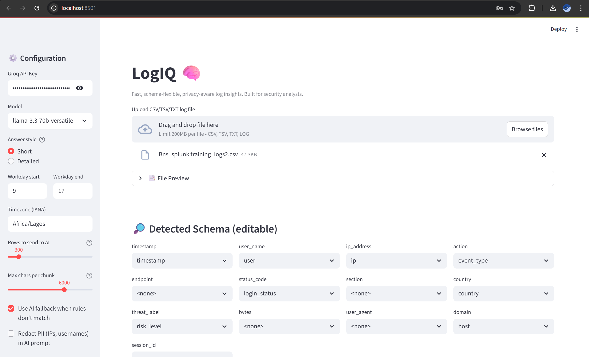

LogIQ🧠 is a **Streamlit-powered tool** designed for **cybersecurity analysts** to quickly analyze and query raw log files (CSV/TSV/TXT/LOG).  
It combines **rule-based detection** with **AI-powered analysis** (via Groq LLMs) to deliver **fast, schema-flexible, privacy-aware log insights**.

---

## 🚀 Features

- **Upload & Preview Logs**  
  Supports CSV, TSV, TXT, and LOG formats with auto-delimiter detection.

- **Automatic Schema Detection**  
  Smart heuristics to map common fields like:
  - Timestamp  
  - User / Account  
  - IP Address  
  - Endpoint / Action  
  - Status Code  
  - Threat Labels  

- **Rule-Based Queries (Fast, Local, No AI Needed)**  
  - Top users  
  - Top IPs  
  - After-hours logins  
  - Failed/unauthorized login attempts  
  - Top endpoints  
  - Course access tracking (BNS training context)

- **AI Fallback (Groq LLMs)**  
  If no rule matches, a compact **sample of logs** (with optional PII redaction) is sent to Groq models:  
  - `llama-3.3-70b-versatile` (recommended)  
  - `llama-3.1-8b-instant` (fast fallback)  

- **Privacy-Aware**  
  - Logs are processed locally first.  
  - Only compact samples + summaries are sent to AI.  
  - Optional IP and username redaction.

- **Interactive Visualizations**  
  Built with **Altair** for quick insights:
  - Bar charts (top users, IPs, endpoints)  
  - Time-series charts (failed logins, after-hours activity)  

- **Export Results**  
  Download filtered results as CSV.

---

## 🖼️ Screenshots / Demo


- **Home Page:**  
  

- **Schema Detection:**  
   

- **Query Results with Visualization:**  
  


- **AI-Powered Insights:**  
  
   
    


---

## 🛠️ Tech Stack

- [Python 3.11+](https://www.python.org/)  
- [Streamlit](https://streamlit.io/)  
- [Pandas](https://pandas.pydata.org/)  
- [Altair](https://altair-viz.github.io/)  
- [Groq API](https://groq.com/)  

---

## ⚡ Installation

```bash
git clone https://github.com/DennisSev7n/LogIQ.git
cd LogIQ

# Create and activate a virtual environment
python -m venv venv
source venv/bin/activate  # or .\venv\Scripts\activate on Windows

# Install dependencies
pip install -r requirements.txt
```

---

## ▶️ Usage

Run the Streamlit app:

```bash
streamlit run main.py
```

Upload your log file (`.csv`, `.tsv`, `.txt`, `.log`) and start querying.

---

## 🔐 Example Queries

- *"Who are the top users?"*  
- *"Which IPs are most active?"*  
- *"Show failed logins."*  
- *"Who logged in after working hours?"*  

---

## 📊 Example Outputs


- **Top Users Query:**  
  

- **Failed Logins Over Time:**  
 

---

## 🙏 Acknowledgements

Special thanks to **BNS Cyber Lab** for providing the opportunity and environment to work on this project.  

---

## 📜 License

MIT License – feel free to fork, extend, and adapt.
